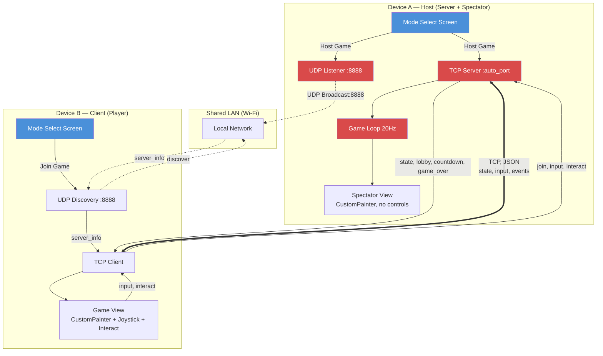

# Technical Design Document: CTF Mobile MVP

## 1. System Architecture Overview

### Architecture Pattern

**Monolithic Flutter app, dual-mode.** A single binary operates in one of two modes selected at launch:

- **Server Mode (Host):** Starts an in-process TCP game server + UDP discovery listener. Renders a spectator view of the game. Host cannot play — must join from a separate device.
- **Client Mode (Joiner):** Discovers servers via UDP broadcast, connects via TCP, renders the game with full player controls (virtual joystick + interact button).

Both modes share the same `core/` and `network/` layers. Only the UI and input handling diverge.

### High-Level System Topology



### Architectural Trade-offs

| Decision                                     | Chosen                             | Alternative                               | Rationale                                                                                                                                                                                                                                           |
| :------------------------------------------- | :--------------------------------- | :---------------------------------------- | :-------------------------------------------------------------------------------------------------------------------------------------------------------------------------------------------------------------------------------------------------- |
| **Monolith vs. separate server binary**      | Monolith (dual-mode in-app)        | Separate Dart CLI server + Flutter client | Simpler build, single codebase, matches project rules. Trade-off: server competes for CPU with Flutter UI on same device. Acceptable — game logic is lightweight math, not physics simulation.                                                      |
| **In-memory state vs. local DB**             | In-memory                          | SQLite, Hive, Isar                        | No persistence needed. State lives for one match lifetime. Reset on server restart. Zero I/O overhead.                                                                                                                                              |
| **CustomPainter vs. Flame**                  | CustomPainter + Canvas             | Flame game engine                         | Flame adds ~500 KB + component tree overhead for no benefit. Our render is simple shapes + coordinate transform. Full control over draw order and pixel mapping.                                                                                    |
| **Riverpod code-gen vs. manual**             | Riverpod with `riverpod_generator` | Manual `StateNotifier` or BLoC            | Code-gen reduces boilerplate, enforces immutable state, generates `.g.dart` with `build_runner`. Same pattern as Freezed.                                                                                                                           |
| **Freezed sealed unions vs. manual classes** | Freezed + `json_serializable`      | Manual `toJson`/`fromJson`                | 12 message types × bidirectional serialization = 24 methods to maintain manually. Freezed gives pattern matching, `copyWith`, and compile-time exhaustiveness checks.                                                                               |
| **Forui vs. Material**                       | Forui                              | Flutter Material                          | Lighter visual weight, shadcn/ui-inspired design, works alongside Material where needed (MaterialApp wrapper is compatible).                                                                                                                        |
| **dart:io vs. 3rd-party sockets**            | dart:io (native)                   | web_socket_channel, socket_io             | Required by SPEC §1.1: "usar los sockets básicos que ya trae el lenguaje." No choice — must use raw TCP/UDP.                                                                                                                                        |
| **Async I/O vs. Isolates for 100 clients**   | Async I/O (single isolate)         | `dart:isolate` per connection             | 100 concurrent TCP streams in a single async event loop is well within Dart's capacity. Game loop is 20 Hz (50ms per tick); writing 100 × ~2KB JSON messages async takes < 5ms. Isolates add serialization overhead that would hurt tick stability. |

---

## 2. Component Design & Codebase Layout

### Directory Architecture

```
lib/
├── main.dart                          # Entry point, runs MainApp
├── app.dart                           # FTheme wrapper, AppShell routing by mode
│
├── core/                              # Shared: no Flutter dependency, pure Dart
│   ├── messages.dart                  # Freezed sealed union — all 12 message types
│   ├── messages.freezed.dart          # Generated
│   ├── messages.g.dart                # Generated (json_serializable)
│   ├── constants.dart                 # Protocol constants (map_size, speeds, limits)
│   ├── validation.dart                # Name sanitization, field type checks
│   └── geometry.dart                  # Distance, clamp, spawn position, victory check
│
├── network/                           # Socket layer (dart:io, no Flutter)
│   ├── tcp_framing.dart              # Buffer accumulator, newline split, coalescence
│   ├── tcp_client.dart               # Connect, send Message, Stream<Message> receive
│   ├── tcp_server.dart               # Listen, accept N clients, per-client Streams
│   └── udp_discovery.dart            # Broadcast discover, listen server_info, manual IP
│
├── server/                            # Server-only logic (no Flutter)
│   ├── server_state.dart             # Immutable game world state
│   ├── server_state_machine.dart     # Lobby → Countdown → Playing → GameOver → Lobby
│   └── server_game_loop.dart         # Timer.periodic(50ms), tick logic, broadcast
│
├── client/                            # Client UI and rendering
│   ├── app_shell.dart                # Top-level: switches screen by AppMode provider
│   │
│   ├── screens/
│   │   ├── mode_select_screen.dart   # "Host Game" / "Join Game" buttons
│   │   ├── server_name_screen.dart   # Enter server name (host only)
│   │   ├── discovery_screen.dart     # Server list + manual IP entry
│   │   ├── name_entry_screen.dart    # Enter player name (joiner only)
│   │   ├── lobby_screen.dart         # Player list, start button (host), countdown overlay
│   │   └── game_screen.dart          # GameCanvas + controls, game over overlay
│   │
│   ├── painters/
│   │   └── game_painter.dart         # CustomPainter: map, circle, players, flag
│   │
│   ├── input/
│   │   ├── virtual_joystick.dart     # Touch-based 8-directional joystick
│   │   └── interact_button.dart      # Large tap target for flag capture/steal
│   │
│   └── providers/
│       ├── app_mode_provider.dart    # Current screen/mode state
│       ├── discovery_provider.dart   # DiscoveredServers list + scanning state
│       ├── connection_provider.dart  # TcpClient lifecycle, send/Stream<Message>
│       ├── game_state_provider.dart  # Parsed GameState from `state` messages
│       └── server_provider.dart      # Server lifecycle (start/stop), state machine
│
└── shared/
    └── logger.dart                    # Configured Logger instance, debug-only message logging
```

### Dependency Graph

```
client/ ──depends on──> core/
client/ ──depends on──> network/
server/ ──depends on──> core/
server/ ──depends on──> network/
network/ ──depends on──> core/
client/ │ server/  (never import each other)
```

No circular dependencies. `core/` has zero imports from other project packages. `network/` only depends on `core/` and `dart:io`.

---

## 3. Protocol Message Contract

> This section replaces the traditional REST/GraphQL API section. The protocol is the full external interface.

### Message Catalog (Freezed Union)

```dart
// lib/core/messages.dart

import 'package:freezed_annotation/freezed_annotation.dart';

part 'messages.freezed.dart';
part 'messages.g.dart';

// --- UDP Messages ---

@freezed
sealed class UdpMessage with _$UdpMessage {
  const factory UdpMessage.discover({@Default(1) int v}) = Discover;

  const factory UdpMessage.serverInfo({
    @Default(1) int v,
    required String name,
    @JsonKey(name: 'tcp_port') required int tcpPort,
    required String state,    // "lobby" | "playing"
    required int players,
  }) = ServerInfo;

  factory UdpMessage.fromJson(Map<String, dynamic> json) =>
      _$UdpMessageFromJson(json);
}

// --- TCP Messages (Client → Server) ---

@freezed
sealed class ClientMessage with _$ClientMessage {
  const factory ClientMessage.join({
    @Default(1) int v,
    required String name,
  }) = Join;

  const factory ClientMessage.input({
    @JsonKey(fromJson: _dirFromJson, toJson: _dirToJson)
    required Dir dir,
  }) = Input;

  const factory ClientMessage.interact() = Interact;

  factory ClientMessage.fromJson(Map<String, dynamic> json) =>
      _$ClientMessageFromJson(json);
}

// --- TCP Messages (Server → Client) ---

@freezed
sealed class ServerMessage with _$ServerMessage {
  const factory ServerMessage.welcome({
    @JsonKey(name: 'player_id') required String playerId,
    required WelcomeConfig config,
  }) = Welcome;

  const factory ServerMessage.lobby({
    required List<LobbyPlayer> players,
  }) = Lobby;

  const factory ServerMessage.countdown({required int seconds}) = Countdown;

  const factory ServerMessage.start() = Start;

  const factory ServerMessage.state({
    required Flag flag,
    required List<GamePlayer> players,
  }) = StateMsg;

  const factory ServerMessage.gameOver({
    required String winner,
    @JsonKey(name: 'type') @Default('game_over') String type,
  }) = GameOver;

  const factory ServerMessage.error({required String reason}) = ErrorMsg;

  factory ServerMessage.fromJson(Map<String, dynamic> json) =>
      _$ServerMessageFromJson(json);
}

// --- Nested Types ---

@freezed
class Dir with _$Dir {
  const factory Dir({required int x, required int y}) = _Dir;
  factory Dir.fromJson(Map<String, dynamic> json) => _$DirFromJson(json);
}

@freezed
class WelcomeConfig with _$WelcomeConfig {
  const factory WelcomeConfig({
    @JsonKey(name: 'map_size') required int mapSize,
    @JsonKey(name: 'circle_radius') required int circleRadius,
    @JsonKey(name: 'player_radius') required int playerRadius,
    @JsonKey(name: 'interact_radius') required int interactRadius,
    required int speed,
    @JsonKey(name: 'tick_rate') required int tickRate,
  }) = _WelcomeConfig;
  factory WelcomeConfig.fromJson(Map<String, dynamic> json) =>
      _$WelcomeConfigFromJson(json);
}

@freezed
class LobbyPlayer with _$LobbyPlayer {
  const factory LobbyPlayer({required String id, required String name}) =
      _LobbyPlayer;
  factory LobbyPlayer.fromJson(Map<String, dynamic> json) =>
      _$LobbyPlayerFromJson(json);
}

@freezed
class Flag with _$Flag {
  const factory Flag({
    String? owner,
    required double x,
    required double y,
  }) = _Flag;
  factory Flag.fromJson(Map<String, dynamic> json) => _$FlagFromJson(json);
}

@freezed
class GamePlayer with _$GamePlayer {
  const factory GamePlayer({
    required String id,
    required double x,
    required double y,
  }) = _GamePlayer;
  factory GamePlayer.fromJson(Map<String, dynamic> json) =>
      _$GamePlayerFromJson(json);
}
```

### Serialization Rules

| Rule                | Detail                                                                                   |
| :------------------ | :--------------------------------------------------------------------------------------- |
| JSON field names    | `@JsonKey(name: 'snake_case')` maps Dart `camelCase` to protocol `snake_case`            |
| Unknown fields      | `json_serializable` ignores by default — compliant with SPEC "lectura tolerante"         |
| `flag.owner`        | `String?` — `null` maps to JSON `null` (never `0` or `""`)                               |
| `type` field        | Inferred from Freezed variant name, serialized automatically via `@JsonKey` where needed |
| Message version `v` | Only on `discover`, `server_info`, `join`. Default `1`.                                  |
| `GameOver.type`     | Freezed discriminator auto-serializes to `"game_over"`                                   |

### Enums (Replacing Raw Strings)

All stringly-typed protocol values are modeled as Dart enums with `@JsonValue` annotations for wire-format mapping:

```dart
// lib/core/messages.dart (add to existing file)

/// Server state in server_info response
enum ServerState {
  @JsonValue('lobby') lobby,
  @JsonValue('playing') playing;
}

/// Game phase — drives screen transitions and logic guards
enum GamePhase {
  @JsonValue('lobby') lobby,
  @JsonValue('countdown') countdown,
  @JsonValue('playing') playing,
  @JsonValue('game_over') gameOver;
}

/// Protocol error codes per SPEC §5.1
enum ErrorReason {
  @JsonValue('INVALID_JSON') invalidJson,
  @JsonValue('UNKNOWN_TYPE') unknownType,
  @JsonValue('MISSING_FIELD') missingField,
  @JsonValue('INVALID_FIELD') invalidField,
  @JsonValue('INVALID_PHASE') invalidPhase,
  @JsonValue('VERSION_MISMATCH') versionMismatch,
  @JsonValue('LOBBY_FULL') lobbyFull,
  @JsonValue('NAME_INVALID') nameInvalid,
  @JsonValue('GAME_STARTED') gameStarted,
  @JsonValue('MESSAGE_TOO_LARGE') messageTooLarge,
  @JsonValue('NOT_JOINED') notJoined;
}
```

**Usage in Freezed types:**

```dart
const factory UdpMessage.serverInfo({
  @Default(1) int v,
  required String name,
  @JsonKey(name: 'tcp_port') required int tcpPort,
  required ServerState state,   // was: String
  required int players,
}) = ServerInfo;

@freezed
class GameWorld with _$GameWorld {
  const factory GameWorld({
    required GamePhase phase,    // was: String
    required List<LobbyPlayer> lobbyPlayers,
    @Default(5) int countdownSeconds,
    Flag? flag,
    required List<GamePlayer> gamePlayers,
    String? playerId,
    String? winnerId,
  }) = _GameWorld;
}
```

**Why enums:** compile-time exhaustiveness in `switch` expressions, no typos in string comparisons, `json_serializable` handles `@JsonValue` mapping automatically. The protocol wire format remains identical (`"lobby"`, `"INVALID_JSON"`, etc.) — enums only change the Dart-side representation.

### Framing Implementation

```
TCP Stream:  ...}{"type":"state","flag":...}\n{"type":"state","flag":...}\n{"type":"sta
             ^                                   ^
             buffer accumulates bytes            split at \n → parse → emit
```

```dart
// lib/network/tcp_framing.dart

class TcpFraming {
  final _buffer = <int>[];
  static const _newline = 0x0A; // \n

  /// Feed raw bytes. Returns list of complete JSON strings extracted.
  List<String> feed(List<int> bytes) {
    final messages = <String>[];
    _buffer.addAll(bytes);

    while (true) {
      final newlineIndex = _buffer.indexOf(_newline);
      if (newlineIndex == -1) break;

      // Extract bytes before \n
      var lineBytes = _buffer.sublist(0, newlineIndex);

      // Strip optional \r (Windows line ending tolerance)
      if (lineBytes.isNotEmpty && lineBytes.last == 0x0D) {
        lineBytes = lineBytes.sublist(0, lineBytes.length - 1);
      }

      messages.add(utf8.decode(lineBytes));

      // Remove processed bytes + the \n
      _buffer.removeRange(0, newlineIndex + 1);
    }
    return messages;
  }

  void clear() => _buffer.clear();
}
```

---

## 4. State Management Design

### Riverpod Provider Map

```mermaid
graph TB
    subgraph "App-Level Providers"
        AM[appModeProvider<br/>ModeSelect | HostSetup | Hosting | Discovering | Joining | InGame]
    end

    subgraph "Network Providers"
        DC[discoveryProvider<br/>List<ServerInfo> + scanning state]
        CN[connectionProvider<br/>TcpClient lifecycle]
    end

    subgraph "Game State Providers"
        GS[gameStateProvider<br/>GameWorld: players, flag, phase]
        SS[serverProvider<br/>Server lifecycle when hosting]
    end

    AM -->|mode == Discovering| DC
    AM -->|mode == Hosting| SS
    CN -->|state messages| GS
    SS -->|broadcast| CN

    GS -.->|drives| GameCanvas
    GS -.->|drives| LobbyWidget
    GS -.->|drives| GameOverWidget
```

### Provider Definitions

```dart
// lib/client/providers/app_mode_provider.dart
import 'package:riverpod_annotation/riverpod_annotation.dart';
part 'app_mode_provider.g.dart';

@freezed
sealed class AppModeState with _$AppModeState {
  const factory AppModeState.modeSelect() = ModeSelect;
  const factory AppModeState.hostSetup() = HostSetup;
  const factory AppModeState.hosting({required String serverName}) = Hosting;
  const factory AppModeState.discovering() = Discovering;
  const factory AppModeState.joining({
    required String ip,
    required int port,
  }) = Joining;
  const factory AppModeState.inGame({
    required String playerId,
    required bool isSpectator,
  }) = InGame;
}

@riverpod
class AppMode extends _$AppMode {
  @override
  AppModeState build() => const AppModeState.modeSelect();

  void selectHost() => state = const AppModeState.hostSetup();
  void startHosting(String name) => state = AppModeState.hosting(serverName: name);
  void selectJoin() => state = const AppModeState.discovering();
  void joinServer(String ip, int port) =>
      state = AppModeState.joining(ip: ip, port: port);
  void enterGame(String playerId, bool isSpectator) =>
      state = AppModeState.inGame(playerId: playerId, isSpectator: isSpectator);
  void backToLobby() => /* depends on mode: Hosting or reset */;
  void backToMenu() => state = const AppModeState.modeSelect();
}
```

```dart
// lib/client/providers/game_state_provider.dart
import 'package:riverpod_annotation/riverpod_annotation.dart';
part 'game_state_provider.g.dart';

@freezed
class GameWorld with _$GameWorld {
  const factory GameWorld({
    required GamePhase phase,     // Enum: lobby | countdown | playing | gameOver
    @Default([]) List<LobbyPlayer> lobbyPlayers,
    @Default(5) int countdownSeconds,
    Flag? flag,
    @Default([]) List<GamePlayer> gamePlayers,
    String? playerId,              // This client's player_id (null for spectator)
    String? winnerId,
  }) = _GameWorld;
}

@riverpod
class GameState extends _$GameState {
  @override
  GameWorld build() => const GameWorld(
    phase: 'lobby',
    lobbyPlayers: [],
    gamePlayers: [],
  );

  void onWelcome(Welcome msg) {
    state = state.copyWith(playerId: msg.playerId);
  }

  void onLobby(Lobby msg) {
    state = state.copyWith(
      phase: GamePhase.lobby,
      lobbyPlayers: msg.players,
      gamePlayers: [],
      flag: null,
      countdownSeconds: 5,
    );
  }

  void onCountdown(Countdown msg) {
    state = state.copyWith(
      phase: GamePhase.countdown,
      countdownSeconds: msg.seconds,
    );
  }

  void onStart(Start _) {
    state = state.copyWith(phase: GamePhase.playing);
  }

  void onState(StateMsg msg) {
    state = state.copyWith(
      flag: msg.flag,
      gamePlayers: msg.players,
    );
  }

  void onGameOver(GameOver msg) {
    state = state.copyWith(
      phase: GamePhase.gameOver,
      winnerId: msg.winner,
    );
  }
}
```

### Message Logging (Debug Mode)

```dart
// lib/shared/logger.dart
import 'package:logger/logger.dart';

final appLogger = Logger(
  filter: ProductionFilter(),  // Only show warnings+ in release
  printer: PrettyPrinter(
    methodCount: 0,
    errorMethodCount: 5,
    lineLength: 80,
    colors: true,
    printEmojis: false,
  ),
  output: ConsoleOutput(),
);

/// Log every sent and received message in debug mode.
/// Called from [TcpClient] and [TcpServer] on each serialized message.
void logMessage(String direction, String rawJson) {
  appLogger.d('$direction | $rawJson');
}
```

---

## 5. Network Layer Design

### TCP Client Lifecycle

```dart
// lib/network/tcp_client.dart

class TcpClient {
  final String host;
  final int port;
  Socket? _socket;
  final _framing = TcpFraming();
  final _messageController = StreamController<ServerMessage>.broadcast();

  Stream<ServerMessage> get messages => _messageController.stream;

  Future<void> connect() async {
    _socket = await Socket.connect(host, port);
    _socket!.listen(
      (data) {
        final jsons = _framing.feed(data);
        for (final json in jsons) {
          logMessage('RECV', json);
          final msg = ServerMessage.fromJson(jsonDecode(json));
          _messageController.add(msg);
        }
      },
      onDone: () => _messageController.close(),
      onError: (e) => _messageController.addError(e),
    );
  }

  void send(ClientMessage message) {
    final json = jsonEncode(message.toJson());
    logMessage('SEND', json);
    _socket?.write('$json\n');
  }

  Future<void> close() async {
    await _socket?.close();
    await _messageController.close();
  }
}
```

### TCP Server Connection Management

```dart
// lib/network/tcp_server.dart

class TcpServer {
  final Map<String, ClientSession> _sessions = {}; // playerId → session
  final _onJoinController = StreamController<ClientSession>.broadcast();
  Stream<ClientSession> get onJoin => _onJoinController.stream;

  Future<void> start(int port) async {
    final server = await ServerSocket.bind(InternetAddress.anyIPv4, port);
    server.listen((socket) {
      final session = ClientSession(socket);
      // Wait for join message before registering
      session.messages.firstWhere((m) => m is Join).then((joinMsg) {
        final join = joinMsg as Join;
        final playerId = _generatePlayerId();
        _sessions[playerId] = session..playerId = playerId;
        _onJoinController.add(session);
      });
    });
  }

  void broadcast(ServerMessage message) {
    final json = jsonEncode(message.toJson());
    logMessage('BCAST', json);
    final data = '$json\n';
    for (final session in _sessions.values) {
      if (session.isActive) {
        session.socket.write(data);
      }
    }
  }

  /// Coalescible send: for `state` messages only.
  /// Overwrites pending writes to slow clients with latest state.
  void broadcastCoalescible(StateMsg message) {
    final json = jsonEncode(message.toJson());
    final data = '$json\n';
    for (final session in _sessions.values) {
      session.enqueueCoalescible(data);
    }
  }

  String _generatePlayerId() =>
      'p_${DateTime.now().millisecondsSinceEpoch}_${Random().nextInt(9999)}';
}
```

### UDP Discovery Flow

```dart
// lib/network/udp_discovery.dart

class UdpDiscovery {
  static const discoveryPort = 8888;

  /// Send discover to broadcast addresses
  Future<void> sendDiscover() async {
    final sender = await RawDatagramSocket.bind(
      InternetAddress.anyIPv4, 0,
    );
    sender.broadcastEnabled = true;

    const message = '{"type":"discover","v":1}';
    final data = utf8.encode(message);

    // Dual broadcast: limited + subnet
    sender.send(data, InternetAddress('255.255.255.255'), discoveryPort);

    // Subnet broadcast (example: 192.168.1.255)
    final interfaces = await NetworkInterface.list();
    for (final interface in interfaces) {
      for (final addr in interface.addresses) {
        if (addr.type == InternetAddressType.IPv4) {
          final broadcast = _subnetBroadcast(addr);
          if (broadcast != null) {
            sender.send(data, broadcast, discoveryPort);
          }
        }
      }
    }

    sender.close();
  }

  /// Listen for server_info responses
  Stream<ServerInfo> listen() async* {
    final listener = await RawDatagramSocket.bind(
      InternetAddress.anyIPv4, discoveryPort,
      reuseAddress: true,
      reusePort: Platform.isMacOS || Platform.isLinux,
    );

    await for (final event in listener) {
      if (event == RawSocketEvent.read) {
        final datagram = listener.receive();
        if (datagram != null) {
          final json = utf8.decode(datagram.data);
          try {
            final msg = UdpMessage.fromJson(jsonDecode(json));
            if (msg is ServerInfo) yield msg;
          } catch (_) {
            // Non-JSON datagram → silently discard per SPEC
          }
        }
      }
    }
  }

  InternetAddress? _subnetBroadcast(InternetAddress addr) {
    // Parse IP + mask → compute broadcast address
    // e.g., 192.168.1.42/24 → 192.168.1.255
    // (Implementation: bitwise OR of address with inverted mask)
    return null; // simplified; full impl in actual code
  }
}
```

---

## 6. Server Game Loop Design

### Tick Logic (20 Hz)

```dart
// lib/server/server_game_loop.dart

class ServerGameLoop {
  Timer? _tickTimer;
  final ServerGameState _state;
  final TcpServer _server;

  static const tickDuration = Duration(milliseconds: 50); // 20 Hz
  static const dt = 1.0 / 20.0; // seconds per tick

  void start() {
    _tickTimer = Timer.periodic(tickDuration, (_) => _tick());
  }

  void _tick() {
    if (_state.phase != GamePhase.playing) return;

    // 1. Apply movement
      for (final player in _state.players.values) {
        final dir = player.currentDir;
        if (dir.x == 0 && dir.y == 0) continue;

        // Normalize diagonals
        double dx = dir.x.toDouble();
        double dy = dir.y.toDouble();
        if (dx != 0 && dy != 0) {
          dx /= 1.41421356237; // √2
          dy /= 1.41421356237;
        }

        player.x += dx * Constants.speed * dt;
        player.y += dy * Constants.speed * dt;

        // Clamp to [15, 985]
        player.x = player.x.clamp(15.0, 985.0);
        player.y = player.y.clamp(15.0, 985.0);
      }

      // 2. Check victory condition (before processing interactions)
      if (_state.flag.owner != null) {
        final carrier = _state.players[_state.flag.owner]!;
        final dist = carrier.distanceToCenter();
        if (carrier.wasInsideCircle && dist > Constants.victoryDistance) {
          _state.endGame(_state.flag.owner!);
          _server.broadcast(
            const ServerMessage.gameOver(winner: _state.flag.owner!),
          );
          return;
        }
        // Update inside/outside tracking
        carrier.wasInsideCircle = dist <= Constants.victoryDistance;
      }

      // 3. Process interactions (one per tick, in arrival order)
      while (_state.pendingInteractions.isNotEmpty) {
        final (playerId, _) = _state.pendingInteractions.removeFirst();

        if (_state.flag.owner == null) {
          // Try capture
          final player = _state.players[playerId]!;
          final dist = player.distanceTo(500, 500);
          if (dist <= Constants.interactRadius) {
            _state.flag.owner = playerId;
            // Track inside/outside state for victory
            player.wasInsideCircle =
                player.distanceToCenter() <= Constants.victoryDistance;
          }
        } else if (_state.flag.owner != playerId) {
          // Try steal
          final thief = _state.players[playerId]!;
          final carrier = _state.players[_state.flag.owner]!;
          final dist = thief.distanceTo(carrier.x, carrier.y);
          if (dist <= Constants.interactRadius) {
            _state.flag.owner = playerId;
            thief.wasInsideCircle =
                thief.distanceToCenter() <= Constants.victoryDistance;
          }
        }
      // else: self-interact → no-op
    }

    // 4. Broadcast state
    _server.broadcastCoalescible(_state.toStateMsg());
  }

  void stop() {
    _tickTimer?.cancel();
  }
}

class Player {
  double x, y;
  Dir currentDir = const Dir(x: 0, y: 0);
  bool wasInsideCircle = false;

  double distanceToCenter() => sqrt(pow(x - 500, 2) + pow(y - 500, 2));
  double distanceTo(double tx, double ty) => sqrt(pow(x - tx, 2) + pow(y - ty, 2));
}
```

### State Machine Transitions

```dart
// lib/server/server_state_machine.dart

// Uses GamePhase enum from core/messages.dart (shared)

class ServerGameState {
  GamePhase phase = GamePhase.lobby;
  // ...

  void triggerCountdown() {
    if (phase != GamePhase.lobby) return;
    if (players.length < Constants.minPlayers) return;
    phase = GamePhase.countdown;

    // Send 5 → 4 → 3 → 2 → 1 at 1 Hz
    for (var s = 5; s >= 1; s--) {
      Future.delayed(Duration(seconds: 6 - s), () {
        if (phase != GamePhase.countdown) return;
        server.broadcast(ServerMessage.countdown(seconds: s));
      });
    }

    // After 5s: start game
    Future.delayed(const Duration(seconds: 5), () {
      if (phase != GamePhase.countdown) return;
      phase = GamePhase.playing;
      spawnPlayers();
      server.broadcast(const ServerMessage.start());
    });
  }

  void abortCountdown() {
    if (phase != GamePhase.countdown) return;
    phase = GamePhase.lobby;
    server.broadcast(ServerMessage.lobby(players: lobbyPlayerList()));
  }

  void endGame(String winnerId) {
    phase = GamePhase.gameOver;
    server.broadcast(ServerMessage.gameOver(winner: winnerId));

    // Post-game pause → return to lobby
    Future.delayed(Duration(seconds: Constants.postGameSeconds), () {
      resetGame();
      phase = GamePhase.lobby;
      server.broadcast(ServerMessage.lobby(players: lobbyPlayerList()));
    });
  }
}
```

---

## 7. Client Rendering Design

### CustomPainter: Coordinate Mapping

```dart
// lib/client/painters/game_painter.dart

class GamePainter extends CustomPainter {
  final GameWorld state;

  GamePainter(this.state);

  @override
  void paint(Canvas canvas, Size size) {
    // Calculate scale to fit 1000×1000 logical map into available size
    final scale = min(size.width, size.height) / 1000;
    final offsetX = (size.width - 1000 * scale) / 2;
    final offsetY = (size.height - 1000 * scale) / 2;

    canvas.save();
    canvas.translate(offsetX, offsetY);
    canvas.scale(scale);

    _drawMap(canvas);
    _drawCircle(canvas);
    _drawPlayers(canvas);
    _drawFlag(canvas);

    canvas.restore();
  }

  void _drawMap(Canvas canvas) {
    canvas.drawRect(
      const Rect.fromLTWH(0, 0, 1000, 1000),
      Paint()..color = const Color(0xFF1A1A2E),
    );
  }

  void _drawCircle(Canvas canvas) {
    // Circle boundary
    canvas.drawCircle(
      const Offset(500, 500), 300,
      Paint()
        ..color = const Color(0x30FFFFFF)
        ..style = PaintingStyle.stroke
        ..strokeWidth = 2,
    );
  }

  void _drawPlayers(Canvas canvas) {
    for (final player in state.gamePlayers) {
      final isMe = player.id == state.playerId;
      canvas.drawCircle(
        Offset(player.x, player.y), 15,
        Paint()..color = isMe ? const Color(0xFF00FF88) : const Color(0xFF4488FF),
      );
    }
  }

  void _drawFlag(Canvas canvas) {
    final flag = state.flag;
    if (flag == null) return;
    // Simple triangle flag marker
    final path = Path()
      ..moveTo(flag.x, flag.y - 10)
      ..lineTo(flag.x + 12, flag.y)
      ..lineTo(flag.x, flag.y + 10)
      ..close();
    canvas.drawPath(
      path,
      Paint()..color = const Color(0xFFFF4444),
    );
    // Pole
    canvas.drawLine(
      Offset(flag.x, flag.y - 15), Offset(flag.x, flag.y + 15),
      Paint()
        ..color = const Color(0xFFFFFFFF)
        ..strokeWidth = 2,
    );
  }

  @override
  bool shouldRepaint(GamePainter oldDelegate) =>
      state != oldDelegate.state;
}
```

### GameScreen Widget Structure

```dart
// lib/client/screens/game_screen.dart

class GameScreen extends ConsumerWidget {
  @override
  Widget build(BuildContext context, WidgetRef ref) {
    final gameState = ref.watch(gameStateProvider);
    final appMode = ref.watch(appModeProvider);
    final isSpectator = appMode is InGame && appMode.isSpectator;
    final phase = gameState.phase;

    return Stack(
      children: [
        // Game canvas (always visible in playing/gameOver)
        if (phase == GamePhase.playing || phase == GamePhase.gameOver)
          Positioned.fill(
            child: CustomPaint(painter: GamePainter(gameState)),
          ),

        // Controls (player only)
        if (!isSpectator && phase == GamePhase.playing) ...[
          Positioned(
            left: 24,
            bottom: 24,
            child: VirtualJoystick(onDirectionChanged: (dir) {
              ref.read(connectionProvider).send(Input(dir: dir));
            }),
          ),
          Positioned(
            right: 24,
            bottom: 24,
            child: InteractButton(onPressed: () {
              ref.read(connectionProvider).send(const Interact());
            }),
          ),
        ],

        // Countdown overlay
        if (phase == GamePhase.countdown)
          Center(
            child: Text(
              '${gameState.countdownSeconds}',
              style: const TextStyle(fontSize: 96, color: Colors.white),
            ),
          ),

        // Game over overlay
        if (phase == GamePhase.gameOver)
          _GameOverOverlay(winnerId: gameState.winnerId),
      ],
    );
  }
}
```

### Virtual Joystick Logic

```dart
// lib/client/input/virtual_joystick.dart

class VirtualJoystick extends StatefulWidget {
  final void Function(Dir dir) onDirectionChanged;
  // ...
}

class _VirtualJoystickState extends State<VirtualJoystick> {
  Offset? _dragOffset;
  static const _deadZone = 20.0; // pixels of dead zone
  static const _maxRadius = 60.0; // max thumb drag distance

  Dir _offsetToDir(Offset offset) {
    final distance = offset.distance;
    if (distance < _deadZone) return const Dir(x: 0, y: 0);

    // Normalize to [-1, 1] range
    final nx = (offset.dx / _maxRadius).clamp(-1.0, 1.0);
    final ny = (offset.dy / _maxRadius).clamp(-1.0, 1.0);

    // Quantize to discrete 8 directions
    return Dir(
      x: _quantize(nx),
      y: _quantize(ny),
    );
  }

  int _quantize(double v) {
    if (v < -0.3) return -1;
    if (v > 0.3) return 1;
    return 0;
  }
}
```

---

## 8. Input Validation & Anti-Cheat

### Server-Side Validation Rules

```dart
// lib/core/validation.dart

class ProtocolValidator {
  /// Validate a join name per SPEC
  static String? validateName(String raw) {
    final trimmed = raw.trim();
    if (trimmed.isEmpty) return 'NAME_INVALID';
    if (trimmed.length > Constants.nameMaxLength) return 'NAME_INVALID';

    // No control characters or newlines
    if (trimmed.contains(RegExp(r'[\x00-\x1F\x7F]'))) return 'NAME_INVALID';

    return null; // valid
  }

  /// Validate dir values are strictly {-1, 0, 1}
  static bool isValidDir(Dir dir) {
    return (dir.x == -1 || dir.x == 0 || dir.x == 1) &&
           (dir.y == -1 || dir.y == 0 || dir.y == 1);
  }

  /// Validate message size (before framing newline)
  static bool isValidSize(int byteLength) {
    return byteLength <= Constants.messageMaxSize;
  }
}
```

### Server Enforcement Points

| Attack Vector                                | Server Mitigation                                                                              |
| :------------------------------------------- | :--------------------------------------------------------------------------------------------- |
| Client sends arbitrary `x, y` coordinates    | Ignored — only `dir` intent accepted. Server calculates position.                              |
| Client sends `dir` values outside {-1, 0, 1} | Rejected with `INVALID_FIELD` error.                                                           |
| Client sends massive JSON payload            | Connection closed with `MESSAGE_TOO_LARGE` if > 64 KB.                                         |
| Client sends `join` mid-game                 | Rejected with `GAME_STARTED` + connection close.                                               |
| Client claims victory                        | Ignored — victory computed server-side only.                                                   |
| Client floods `interact` messages            | Processed one per tick in arrival order per SPEC. No advantage from flooding.                  |
| Client impersonates another `player_id`      | Server assigns `player_id` on `join`; it's never sent by client.                               |
| Repeated malformed JSON                      | Tolerated once (`INVALID_JSON` without close). On repeated offenses, connection may be closed. |

---

## 9. Testing Strategy

### Testing Matrix

| Layer                           | Tool               | Target Coverage | Key Test Cases                                                                                                                                                                            |
| :------------------------------ | :----------------- | :-------------- | :---------------------------------------------------------------------------------------------------------------------------------------------------------------------------------------- |
| **Unit — Messages**             | `flutter_test`     | ≥ 95%           | Round-trip `toJson()` → `fromJson()` for all 12 types. `flag.owner=null` serialization. Unknown field tolerance.                                                                          |
| **Unit — Validation**           | `flutter_test`     | ≥ 95%           | Name: empty, 1 char, 20 chars, 21 chars, control chars, trim. Dir: all 9 valid combos, invalid values like (2,0), (-2, -2).                                                               |
| **Unit — Geometry**             | `flutter_test`     | ≥ 90%           | Distance formula. Clamp bounds [15, 985]. Spawn positions in ring R∈[350,450]. Victory distance threshold (≤315 inside, >315 outside).                                                    |
| **Unit — Framing**              | `flutter_test`     | ≥ 90%           | Single message. Two concatenated. Split message across two feeds. `\r\n` stripping. Buffer accumulation edge cases.                                                                       |
| **Unit — Server State Machine** | `flutter_test`     | ≥ 90%           | Lobby→Countdown (≥2 players). Countdown abort (< 2 players). Flag capture. Flag steal. Victory transition (inside→outside). Post-game lobby return. Bandera resets on carrier disconnect. |
| **Unit — Host spectator**       | `flutter_test`     | ≥ 80%           | Host cannot send `input`/`interact`. Server rejects these with error.                                                                                                                     |
| **Widget — Screens**            | `flutter_test`     | ≥ 70%           | Every screen renders in: loading, data, empty, and error states. GameScreen: controls hidden in spectator mode. LobbyScreen: start button disabled < 2 players.                           |
| **Integration — E2E round**     | `flutter_test`     | 1 happy path    | Server starts → client discovers → joins → countdown → plays → captures flag → wins → returns to lobby.                                                                                   |
| **Integration — Stress**        | Custom Dart script | 100 conn        | 100 simultaneous TCP clients. 60-second game. No crashes, no missed ticks > 1%.                                                                                                           |
| **Interop — Classmates**        | Manual             | ≥ 3 projects    | Connect to 3 different classmates' servers. Verify lobby, movement, capture, steal, victory.                                                                                              |

### Test File Layout

```
test/
├── core/
│   ├── messages_test.dart
│   ├── validation_test.dart
│   └── geometry_test.dart
├── network/
│   ├── tcp_framing_test.dart
│   └── tcp_server_test.dart
├── server/
│   ├── state_machine_test.dart
│   └── game_loop_test.dart
├── client/
│   ├── screens/
│   │   ├── mode_select_screen_test.dart
│   │   ├── discovery_screen_test.dart
│   │   ├── lobby_screen_test.dart
│   │   └── game_screen_test.dart
│   └── painters/
│       └── game_painter_test.dart
└── integration/
    └── full_round_test.dart
```

---

## 10. Technical Risk Mitigation

| Risk                                    | Type        |  P  |  I  | Mitigation                                                                                                                             |
| :-------------------------------------- | :---------- | :-: | :-: | :------------------------------------------------------------------------------------------------------------------------------------- |
| **UDP broadcast blocked**               | Network     |  M  |  H  | Dual broadcast (255.255.255.255 + subnet). Manual IP:port fallback. Test on campus Wi-Fi early.                                        |
| **Protocol mismatch with peers**        | Interop     |  L  |  H  | Automated message compliance suite. Test against at least 3 classmates before demo. Freezed models catch schema drift at compile time. |
| **100-client broadcast lag**            | Performance |  M  |  M  | `Future.wait` for parallel socket writes. Coalescence of `state` for slow clients. Stress test with 100 mock clients.                  |
| **iOS raw socket restrictions**         | Platform    |  L  |  H  | Test on physical iOS device in Sprint 1. `dart:io` supports iOS sockets; no known restriction for LAN use.                             |
| **Memory leak from zombie connections** | Stability   |  L  |  H  | Explicit `socket.close()` + session removal on TCP close. Stress test with connection churn (connect/disconnect loop).                 |
| **Tick timer drift**                    | Accuracy    |  M  |  M  | Use `Stopwatch` to measure actual tick intervals. Compensate `dt` for drift. Log warnings if tick > 55ms.                              |
| **JSON parsing DoS (deep nesting)**     | Security    |  L  |  M  | SPEC limits nesting to 2 levels. Server should enforce this and reject with `INVALID_JSON`.                                            |
| **Simultaneous client join races**      | Concurrency |  L  |  L  | Server processes messages sequentially per SPEC §2.2. Dart async handles this naturally with `await` queue.                            |
